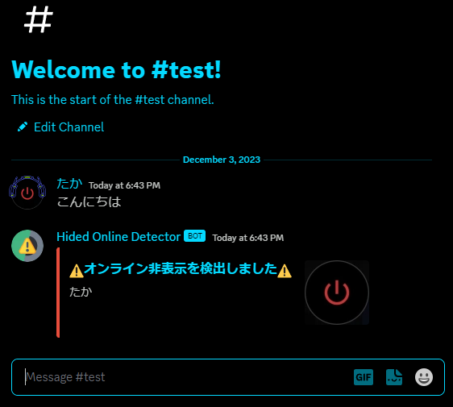
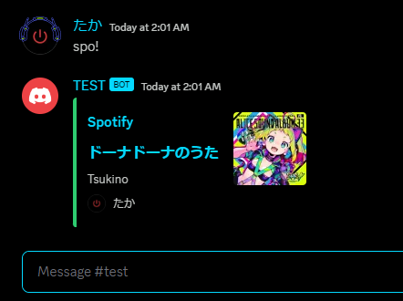

# Discord-Hided-Online-Detector
Discordでオンライン状態を隠しているユーザーが発言した時にそれを検出してメッセージを送信します  
また、ユーザーがSpotifyで音楽を再生しているのも検出することができます
#### コマンドの説明
- detect_on_off  
  使ったチャンネルを検出リストに登録します  
  検出リストに登録されているチャンネルでオンライン状態を非表示にしているユーザーが発言した場合、それを検出して、メッセージを送信します  
- remove_on_off  
 使ったチャンネルをメッセージ削除リストに登録します  
  削除リストに登録されているチャンネルでオンライン状態を非表示にしているユーザーが発言した場合、それを検出して、そのメッセージを削除します  
- !spo  
  発言したユーザーがSpotifyで音楽を再生している場合、それの埋め込みメッセージを送信します  
  おまけみたいな機能です  
## 使い方  
Discordをやっていてたまにオンライン表示を隠しているユーザーがいます  
なんらかの理由でそういったユーザーを検出したい場合、このコードが役に立ちます  
単純なコードですが、なぜかネットで調べても情報が少なかったのでGitHubにアップロードしておきます  
  
このようにオフライン表示にしているユーザーが発言をすると検出してメッセージを送信します  
もちろんアイドル状態(月マーク)や応答不可(赤いマーク)も検出できます  
その場合、15行目の ```if "offline" in message.author.status:``` のコードを編集して  
```if "idle"``` で月マーク、```if "dnd"``` で赤いマークのユーザーを検出するようにできます  
## Spotify検出  
spo!と送信することで発言したユーザーがSpotifyでなにか音楽を再生している場合、それを検出してメッセージを送信します  
これも同様に単純なコードですが、ネットで調べても情報が少なかったので似た性質を持つオフライン検出といっしょに書いておきました  
  
機能としては以上になりますが、Spotifyに関しては発言したユーザー以外の情報を取得しようとするとNoneが返されるので発言者の情報しか取得できないみたいです  
ちなみにほんとうに発言者のみみたいで、スラッシュコマンドでインタラクションを送信するなどしてもNoneが返されました  
不思議です  
### コンタクト  
↓サーバー↓  
https://discord.gg/aSyaAK7Ktm  
僕のDiscord -> .taka.
